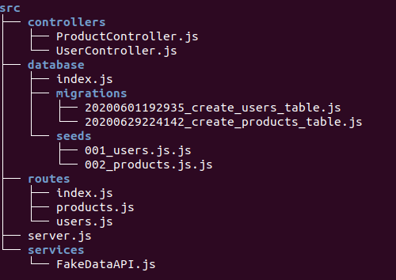

# :green_book: My Personal Node.js API studies

The ideia is to study and practice about Javascript applications and Node's REST APIs.

The structure of *src* directory (Old image):



## :bulb: Techs and Packages

- [Visual Studio Code](https://code.visualstudio.com/)
- [Postman](https://www.postman.com/)
- [Node.js](https://nodejs.org/en/)
- [NPM](https://www.npmjs.com/)
- [PostgreSQL](https://www.postgresql.org/)
- [Express.js](https://expressjs.com/pt-br/)
- [Nodemon](https://nodemon.io/)
- [Knex.js](http://knexjs.org/)
- [Celebrate](https://github.com/arb/celebrate)
- [BCrypt](https://www.npmjs.com/package/bcrypt)
- [JWT](https://jwt.io/)
- [Axios](https://github.com/axios/axios)
- [Nodemailer](https://nodemailer.com/about/)
- [Nerds](https://github.com/SkyHacks/nerds)
- [Jest](https://jestjs.io/)
- [express-fileupload](https://github.com/richardgirges/express-fileupload)
- [Commitlint](https://commitlint.js.org/#/) | [Husky](https://github.com/typicode/husky) | [Commitizen](https://github.com/commitizen)

## :running: Run the API
 
Installing all the packages 

```npm install``` 

Running on *http://localhost:3000*

```npm start``` 

## :wrench: Random and Cool Features

Here are some features made to apply my personal studies.

### Migrations and Seeds with Knex.js

Migrations and Seeds for products and users using Knex.js Query Builder and PostgreSQL. I applied mostly random types and OneToMany relationship at the database.

:gift: You can access the files at the *database* directory and see the configs at *knexfile.js*.

### Update timestamp trigger

Raw SQL procedure and trigger to update the timestamp *updated_at* in the database products and users. Just read the comments at the database files and *knexfile.js*.

### Request's validations using Celebrate

To validate the requests made with Postman was used the Celebrate package which is basically a middleware using Joi. Very simple! You can find it at *routes*.

### Sending Emails with NodeMailer

I used the NodeMailer package along the [Ethereal Service](https://ethereal.email/) to test some fake emails. 

### Authentication and authorization using JWT

JSON Web Token (JWT) to autenticate and authorize users. To apply in the Controllers was made a middleware for autorize the user.

:gift: If you want to see all the auth stuffs, you'll have to seach for the "auth" files.

### TDD with Jest

Usage of Jest package for unit testing at *__test__* directory. So far, my tests are a little bit simple and for the utils functions on *src/utils* directory.

:question: to run the tests

```npm test```

### Uploading file with express-fileupload

Using the express-fileupload package to upload a single file (so far). Take a look at the *FileController.js* and the post route at the *index.js* at routes directory.

### (Not done yet) Consuming APIs using Axios

Using the Axios package to consume my personal [Fake Data API](https://github.com/RafaelEmery/fake-data-api)

Made with :hearts: by [Rafael Emery](https://rafaelemery.github.io)